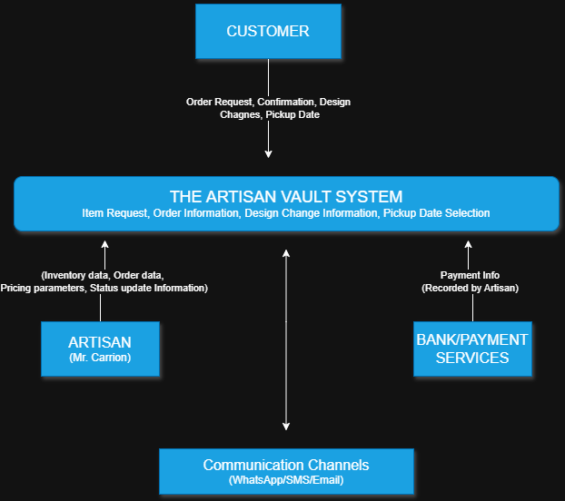

# Context Diagram

## Purpose  
This context diagram defines the **system boundary** for *The Artisan Vault* and identifies all **external entities** that interact with the system. It shows the **flow of information** into and out of the system without describing internal processes. (Ref: Data & Process Modeling chapter, Context Diagram section)

---

## External Entities  
- **Customer** – Requests stock/custom items, confirms orders, receives messages and updates.  
- **Artisan (Señor Carrión)** – Manages orders, pricing, inventory, payments, and updates.  
- **Bank / Payment Service** – Confirms cash/bank transfers externally; the system records payment status.  
- **Messaging Channels (WhatsApp/SMS/Email)** – Used to deliver notifications and photo updates.

---

## Data Flows  

### From Customer → System  
- Order requests  
- Custom order details  
- Order confirmations  
- Pickup date confirmation  
- Design changes  
- Cancellation notice  

### From System → Customer  
- Price quotes  
- Order confirmation  
- Photo update (first notification only)  
- Pickup reminder  
- Delay notification  
- Late fee notification  

### From Artisan → System  
- Inventory updates  
- Order creation/modification  
- Pricing inputs  
- Project status updates  
- Payment recording  

### From System → Artisan  
- Order queue view  
- Pricing breakdown  
- Inventory status  
- Late fee calculations  

### Bank / Messaging Channels  
- Bank → System: Payment confirmation (recorded manually)  
- System → Messaging Channels: Notification content (text + photo)

---

## Context Diagram

